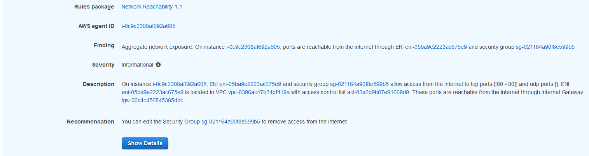

Module 3 - Evaluating Findings
==============================

Let's look at the Inspector Network Reachability report findings and see what we can learn.

1.  Go back to the Assessment Runs. It should be done

2.  Click on “Findings”

*Note: If you see multiple Medium findings and none of the findings indicate the Inspector agent was running, you will need to delete the Assessment and run it again. This means the instances did not have the Inspector agent running at the time of the scan.

We can approach this list of findings in two ways. We can start evaluating our assumptions first, but we all know when we see higher severity findings we want to jump in there. So let’s take a look at a Medium finding first.

3.  Expand the Medium finding  by clicking the arrow to the left of “Medium”

First, write down or copy this ARN, we will need it later. We can see that a misconfigured Security Group is allowing access to an instance and the instance is listening on that port. So Assumption 4 was wrong. This is something the Security team would want addressed first.

So since we know some things are wrong, let’s check the other findings for this server. We do that by filtering by the instance ID.

4.  Highlight the AWS agent ID, copy it, and scroll back to the top to paste the Instance ID of the offending instance in the “Filter”

When you hover over the Finding titles we immediately see multiple findings about Peered connections, one Low and the top three Informational findings. Since we already looked at the SSH finding and know we need to address that, let’s look at the Informational.

5.  Expand the “Finding” Column so you can see enough of the title to see “Peered”

6.  Expand the Informational finding that starts with “Aggregate network exposure” and has “Peered”

7.	Let's check what VPC is peered. Click on the VPC Peering Connection link in the finding to open it in a new window. Note the peer name.

8.	Click on the VPC peer name from the finding.

9.	Click on the Requester VPC in the bottom window.

We see the peer is to the Bastion VPC. This is okay because we want this behavior. What we don’t see, however, is anything about connectivity from the WebApp VPC. That’s because the report knows there’s no way to transit through multiple VPC Peering connections today. So this helps us validate Assumption 3 is true as long as there’s no additional routing the report can’t see (for example a Cisco CSR Transit VPC).

What about the multiple Availability Zone configuration though for this Proof of Concept? Given the misconfiguration, we should check Assumption 2. Since we want to check against multiple Instances, let’s filter by VPC, in this case the PoCVPC.

10.  Close the preview window and go back to the findings. Scroll back to the top and put the VPC ID of the offending instance in the “Filter”. Collapse the first finding you had open.

We want to compare the Internet reachability so the best findings are the “Aggregate network exposure” findings related to the internet. We find those half way down the list. Comparing them visually we see one instance only has port 80 open. 

11.  Expand the first finding that starts with “Aggregate network exposure” and has “internet”

12.  Notice only port 80 is open. Collapse this finding.

13.  Expand the second finding that starts with “Aggregate network exposure” and has “internet” – it will have a different instance ID.

Here we see the other instance has ports 22 and 443 open.

This would indicate than in a failover scenario the second instance would fail to respond to any HTTP traffic. So we must fix this for failover to work. Assumption 2 is busted.

As a note – there’s another way to compare instance findings like this. You can download all of these findings in a .csv file, allowing you to sort, filter, and compare much more programmatically.

The remaining assumption relate to the Private Subnets, so we can move on from the POC Server side. We have a couple of things we need to address so can send this report to the developer to have them fix things. Let’s start looking at the WebApp side. We noticed the route table for the Database subnet was incorrect, so let’s see if that is having any security impact. Again we can filter by the instance ID, or something we expect to see in the finding. For example, let’s filter by the port number: 3306.

14.  Collapse the open findings. Scroll back to the top and put “3306” in the “Filter”

We are looking for instances open to the internet on this port. Here we see on of the first findings indicate the instance has ports are reachable from the internet.

15.  Expand the finding that starts with “Aggregate network exposure” and has “internet”

So we know this is wrong. But rather than following this one recommendation, we know we need to apply a different route table to the subnet. This just shows how there are different ways to solve the same problem, but it requires context. This is a good example where defense in depth is important. You may have set the Security Group to 0.0.0.0/0 for testing or internal access purposes, but because of a bad assumption you potentially put your entire environment at risk.

In the end this proves Assumption 1 was false and needs to be revisited for all servers.

Synopsis
========

Thanks to the Network Reachability report we were able to validate one assumption but prove that 80% of our assumptions had problems due to  misconfigurations. The Network Reachability report gives us confidence in understanding which instances could talk to whom, and in a consistently reportable, auditable manner. This is the power of Amazon Inspector.

But now what? We don't want to leave these issues as they are, so let's see how we can automatically remediate them by combining other AWS tools and services. [Integration and Remediation](04-integration-and-remediation.md) will do just that.