Module 4 - Integration and Remediation
======================================

Remember how we had our assessment send the findings to an SNS topic? We are going to use that to trigger a Lambda function to remediate common findings. We've written a Lambda function to block SSH access to misconfigured instances and included it in the CloudFormation template. Let's build the connection from SNS to Lambda and review the code.

1.	Click on Services on the top right and type in Simple Notification Service. Then click the service.

2.	Click on Topics on the left hand side

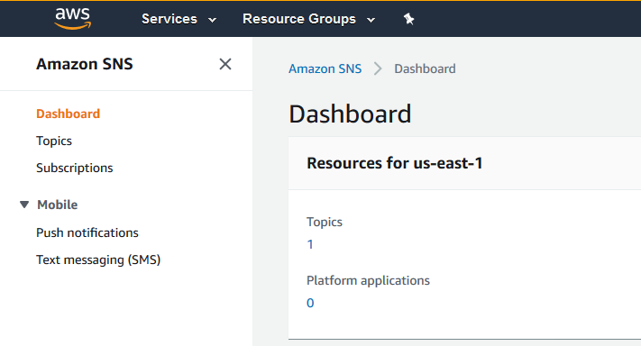

3.	Click on the Topic named "InspectorAutomation"

In order to have the SNS topic send data to Lambda, we need to create a subscription. We should see the subscriptions window on the bottom and it should be empty.

4.	Click Create Subscription

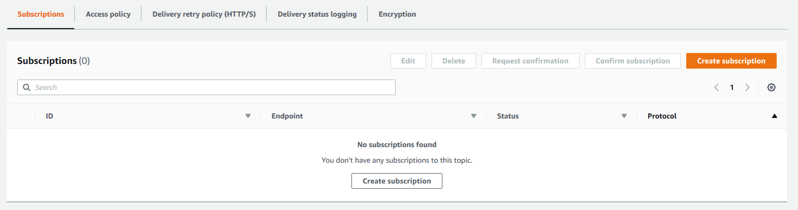

5.	The Topic Arn should be filled out, but if it's not click on it and select the topic.

6.	Click on the Protocol drop down and select AWS Lambda

7.	You should now see another dropdown. Click on it and select the one Lambda function that's there.

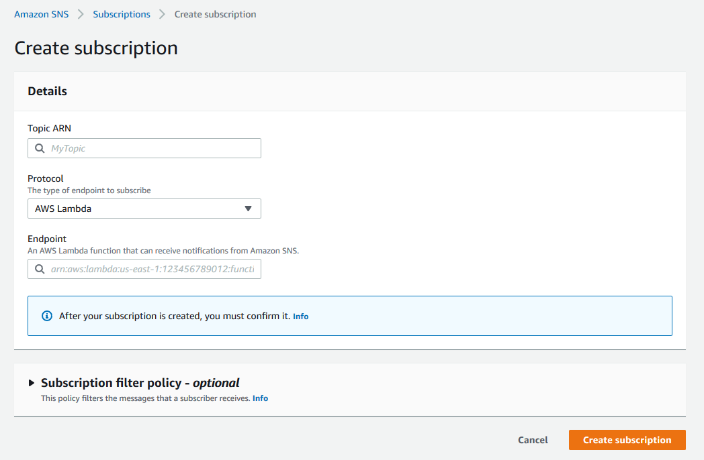

8.	Click Create Subscription

We've now configured SNS to send any alerts it receives to our Lambda function. Our Lambda function is configured to only respond to specific findings in specific ways. If you're interested in reviewing the Lambda function you can go to the Lambda console. If you're not interested in digging into it, here's just the relevant piece of code for this activity.

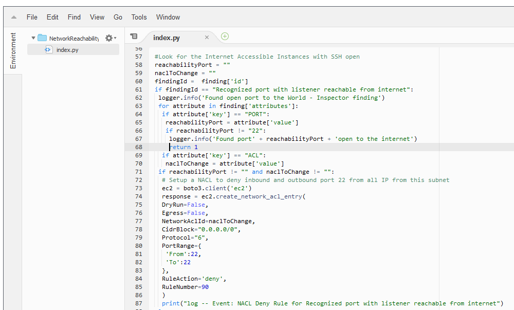

You can see here that the Lambda code adds a Network ACL line that blocks SSH from the internet to any instance that has SSH open to the internet.

To trigger this we need to have Inspector submit a finding to SNS. Rather than wait 15 minutes for Inspector to finish an assessment though, we can simulate this action.

9.	While still in SNS click on Topics on the left hand side

10.	Click on the Topic named "InspectorAutomation"

11.	In the top right click on the button that says "Publish Message"

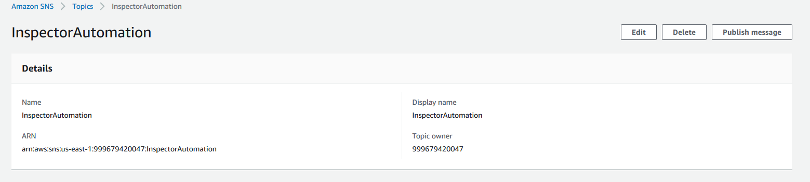

Remember that ARN we copied down in Step 3 of Module 3? We will need that now. If you don't have it, you can go back to Inspector and copy the ARN from the Medium finding. We are going to publish a fake SNS message using the appropriate ARN to kick off the Lambda function.

12.	Paste the ARN into the appropriate place in the following text: {replace the "**INSERT ARN HERE**" with your arn)

```
{"template":"arn:aws:inspector:us-east-1:123456789012:target/0-a12b3c4d/template/0-5e6f7g8h","run":"arn:aws:inspector:us-east-1:123456789012:target/0-a12b3c4d/template/0-5e6f7g8h/run/0-9i0j1k2l","time":"2019-04-09T00:00:01.401Z","finding":"**INSERT ARN HERE**","event":"FINDING_REPORTED","target":"arn:aws:inspector:us-east-1:123456789012:target/0-a12b3c4d"}
```

13.	Paste the SNS message from above in the "Message body to send to the endpoint" text box

14.	Leave all the other fields empty

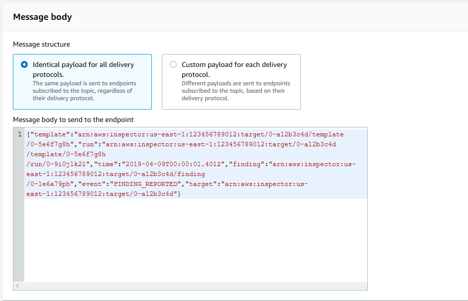

15.	Click "Publish Message"

**Note - Alternatively if you have the time, you can re-run the Inspector report and watch once it's complete to see if the change was made.**

Let's confirm it worked.

16.	Click on Services on the top right and click on VPC

17.	On the left hand navigation click on Network ACLs

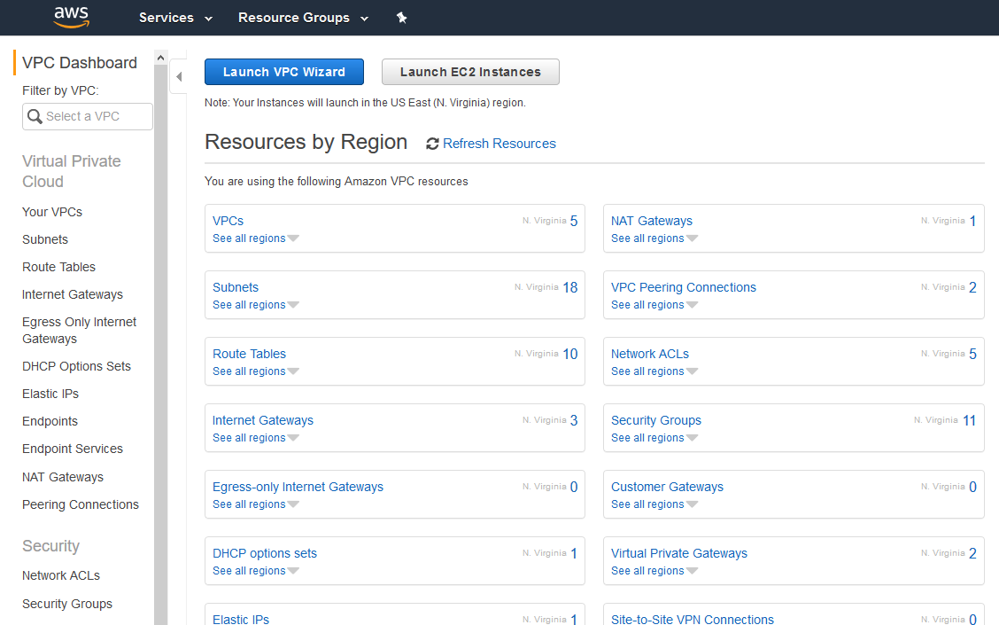

18.	Since we know the Proof of Concept VPC is the one with the misconfiguration, click on the ACL associated with that VPC

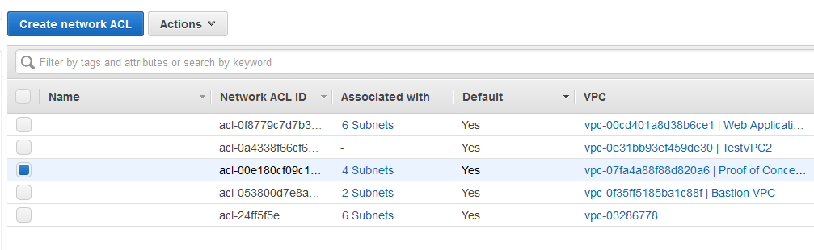

19.	On the bottom navigation, click on "Inbound Rules"

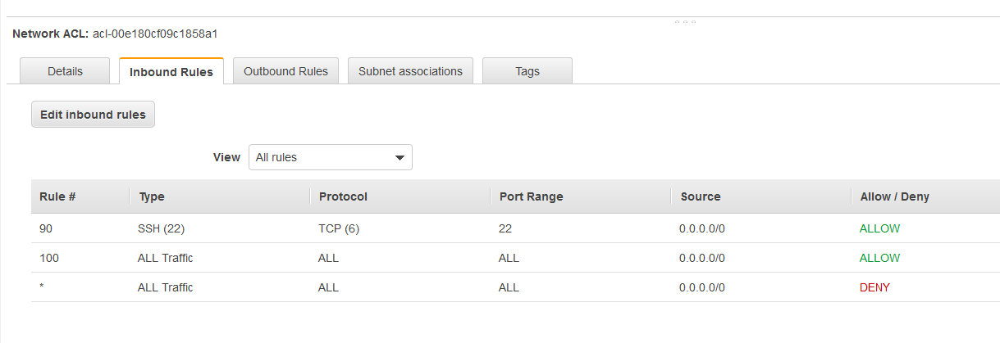

Do we see a rule blocking SSH?

But if SSH is completely blocked to the instance, how can legitimate administrators configure the machine? Well, they can modify the Security Group and then the NACL through their Change Process. But if they want to make sure the instance wasn't compromised there's another option.

20.	Click on Services on the top right and click on Systems Manager

21.	On the left hand navigation, click on Session Manager

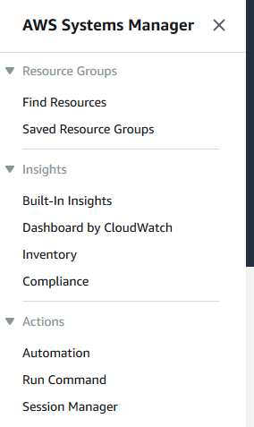

22.	On the right hand side click on Start Session

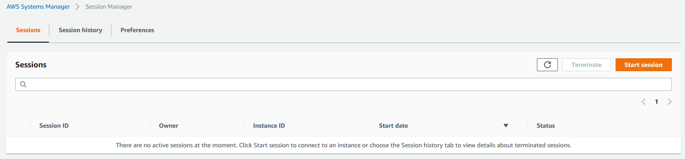

Do you remember the instance ID with the misconfigured Security Group? If not, don't worry, it was the PoC Web Server for AZ2

23.	Click on the radio button next to the instance

24.	Click Start Session

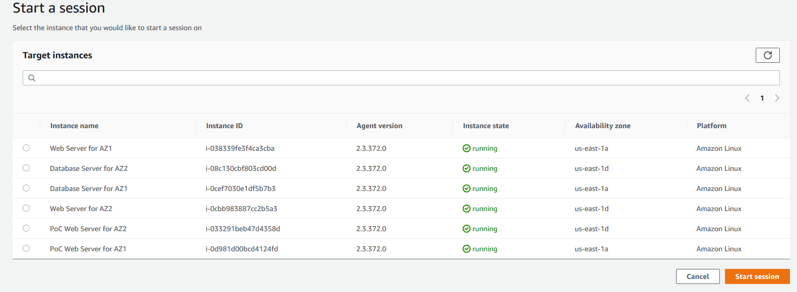

25.	Type "ping 8.8.8.8" - Are you able to ping out to the world? Hit Cntl-C when you're ready to move on.

26. Type "whoami" - What user are you logged into the box as?

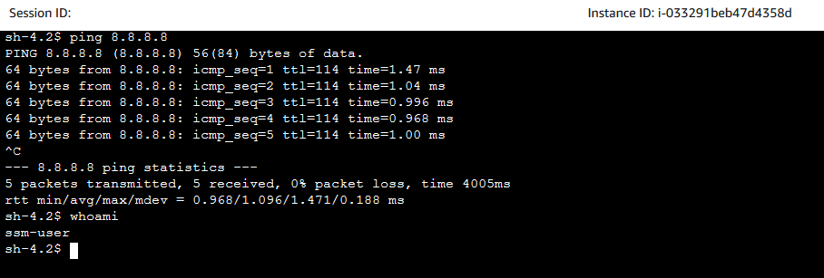

This looks just like an SSH session! Instead though, this is a proxy created by the AWS System Manager Agent installed on the AMI. With the Session Manager feature you can create an SSH-like access to devices that don't have port 22 open at all. All that's necessary is to allow traffic to the Systems Manager Endpoint over port 443 and return traffic.

27.	When you're done, hit "Terminate" in the top right corner

28.	Confirm you want to terminate the session.

So no we've seen how we can use Inspector to kick off a Lambda function and automatically remediate potentially risks configurations. Additionally, we've seen how when we isolate instances from the world, we can still use AWS services to securely access them and perform troubleshooting or incidence response.

Now since there are some instances still open to the internet and potentially vulnerable, let's clean up what we've built.

[Cleanup](05-cleanup.md)