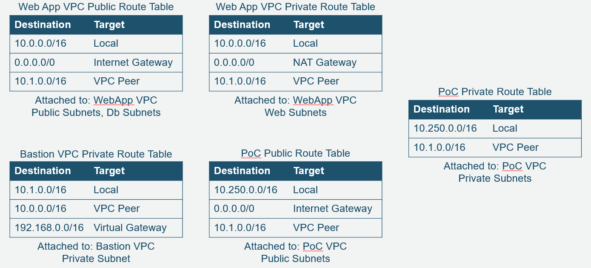

Overview
========

The workshop will demonstrate how you can validate their network configuration without needing to have a deep networking background by using Inspector's Network Reachability report. You will learn how this report can help them find misconfigurations in the architecture or behaviors they might not have expected. The workshop will finish with using the Network Reachability report findings integrated with other Security Services to remediate these issues.

You start with building a sample architecture using common AWS products including Application Load Balancers, EC2, Security Groups, NACLs, Internet Gateways, NAT Gateways, and VPC Peering. The environment will include known ports, unrecognized ports, and Network Exposures. Network exposures will be on agentless systems. You will then run Inspector reports to gather information on the environment and analyze the results for misconfigurations or severe issues. Finally, integration with Security Hub and automated remediation will be configured to deal with common issues.

-	*Level*: Intermediate

-	*Duration*: 1:30 - 2:00 hours

-	*[CSF Functions](https://www.nist.gov/cyberframework/online-learning/components-framework)*: Detect, Respond

-	*[CAF Components](https://d0.awsstatic.com/whitepapers/AWS_CAF_Security_Perspective.pdf)*: Detective, Responsive

-	*[Prerequisites](https://awssecworkshops.com/getting-started/)*: AWS Account, Admin IAM User

Workshop Scenario
=================

Company XYZ has been in AWS for a few months and is moving its first few workloads in the cloud. The first to move was an external website with a database back end. Security insisted that servers are only accessible for administrative access through a set of bastion hosts in a separate VPC. Recently, a developer has created a public proof of concept for a new highly available web service and connected it to the environment without going through all the proper change management. The various IT stakeholders have been working off some assumptions but have not had the chance to test them yet.

Assumption 1.\> Instances in private subnets are not accessible from the internet

Assumption 2.\> Putting servers in different Availability zones provide failover and better reliability

Assumption 3.\> Nothing can route through the bastion VPC.

Assumption 4.\> Access to the servers is limited by least privilege

Assumption 5.\> The bastion hosts can access all environments

The IT team found the new configuration not because of controls, but because the bill came back above budget. Now the security and operations team want to validate the right security is applied to the new environment as well as the existing one. They will use the Network Reachability report in Amazon Inspector to provide them validation of their network assumptions. This is a recent addition to Inspector, going public in November of 2018.

Architecture
============

The CloudFormation template will build the following elements of the demo. These elements will all be built in a single account and will not use any existing VPC’s. This demo should cost \< \$1 per day you leave it running, as long as you shut down the EC2 instances while in the free tier window. The demo uses free tier choices wherever possible. Additionally, this demo should not require the raising of any limits if you are using a fresh account or region, though if you are using a brand new account your containment score may limit the number of instances you can create immediately. If you are using an existing account and region, be aware of the 5 VPC soft limit per region.

3 VPC’s
-   VPC 1 is peered to VPC 3
-   VPC 2 is peered to VPC 3

VPC 1 (Web Application VPC) - 6 subnets
-   2 availability zones per VPC
-   3 subnets per availability zone
    -   1 public
    -   2 private

VPC 2 (Proof of Concept VPC) - 4 subnets
-   2 availability zones per VPC
-   2 subnets per availability zone
    -   1 public
    -   1 private

VPC 3 (Bastion VPC) - 2 subnets
-   2 availability zones per VPC
-   1 subnets per availability zone
    -   1 private

8 Tagged instances
-   6 with Agent
    -   VPC 1 –4 private (2 & 2)
    -   VPC 2 – 2 public, 0 private
-   2 without Agent connectivity
    -   VPC 3 – 0 public, 2 private

Instance Purpose
-   VPC 1 – Public ALB’s, 2 Web servers, 2 database servers
-   VPC 2 – 2 Proof of Concept Servers
-   VPC 3 – 2 Bastion Hosts (SSH and RDP)

Here are the Route Tables and Security Groups as well.

Presentation Deck
=================

When performing this workshop with a leader, it may be helpful to run through the scenario with visual aids. There are also opportunities to go through the questions in the lab as a group instead of just as individuals. The following presentation deck can be integrated with the workshop for me of a guided learning experience.

[Workshop Presentation Deck](./resources/demo-support-presentation.pdf)

The workshop will note where the presentation material may be most useful.

Region
======

Make sure you are in a region supported by Amazon Inspector (<https://docs.aws.amazon.com/inspector/latest/userguide/inspector_supported_os_regions.html>); the recommended region is *us-east-1*.

Modules
=======

The workshop is broken up into the five modules below:

1.	[Environment Build and Configuration](01-environment-setup.md)
2.	[Running the Inspector Report](02-running-inspector.md)
3.	[Evaluating Findings](03-evaluate-findings.md)
4.	[Integration and Remediation](04-integration-and-remediation.md)
5.	[Cleanup](05-cleanup.md)